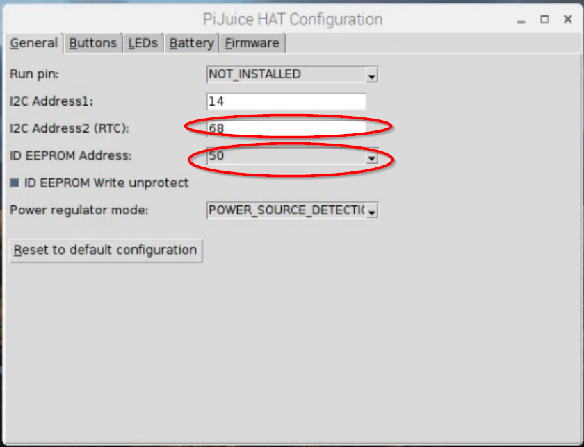
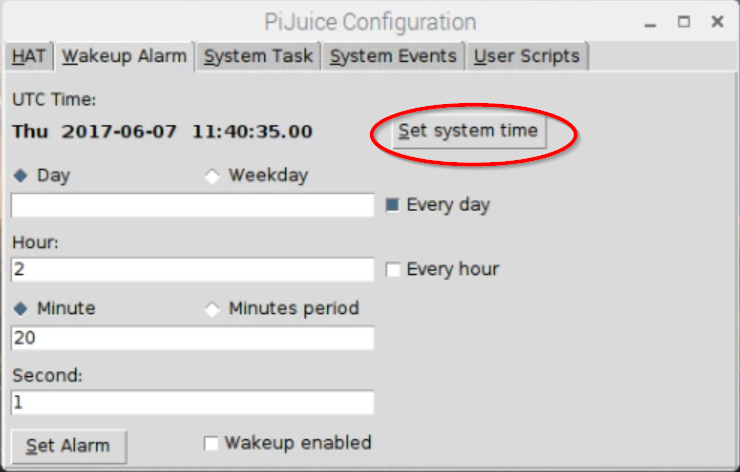
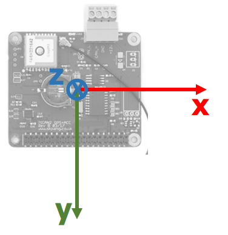

# PiCAN GPS-Gyro-Accelerometer-CAN-Bus HAT + PiJuice HAT Setup on Raspberry Pi 3 Model B with ROS


## Main Reference
- <https://medium.com/@ericmaggard/building-an-autonomous-car-using-a-1-10th-scale-rc-car-part-1-4474706d02b5>
- <http://copperhilltech.com/content/PICANGPSACC_V1.pdf>


## I. System

### 1. OS
Download and install Ubuntu Mate from <https://ubuntu-mate.org/raspberry-pi/>.

It is recommended by ROS to start with Ubuntu Mate 16.04 instead of Raspbian. However, at the time of writing, Ubuntu Mate 16.04 still doesn't support Raspberry Pi 3 Model B+.

### 2. Raspberry Pi Configuration
`sudo raspi-config` and enable the following interfaces under `Interface Options`:
- SSH
- SPI
- IC2
- Serial
- 1-Wire


## II. PiJuice

### 1. PiJuice HAT
To resolve the conflict between PiJuice and PiCAN, some changes to PiJuice configurations are needed, which can only be done through PiJuice GUI. However, at this moment all PiJuice s/w are only available on Raspbian repo, to install them on Ubuntu Mate 16.04, the following steps are needed.

First, download `pijuice-base` from <https://archive.raspberrypi.org/debian/pool/main/p/pijuice-base/> and install  with `gdebi` to resolve dependencies:
```bash
wget PIJUICE_BASE_DEBFILE_URL
sudo gdebi PIJUICE_BASE_DEBFILE
```

Then, download `pijuice-gui` from <https://archive.raspberrypi.org/debian/pool/main/p/pijuice-gui/> and install with `gdebi` to resolve dependencies:
```bash
wget PIJUICE_GUI_DEBFILE_URL
sudo gdebi PIJUICE_GUI_DEBFILE
```

PiJuice icon should appear on task bar after a reboot. Now, right click PiJuice icon and open `settings` to:

- Change PiJuice RTC I2C address from `0x68` to `0x67`, to reserve `0x68` for IMU on PiCAN.
- Change PiJuice EEPROM I2C address from `0x50` to `0x52`, to ensure PiJuice HAT configuration is not loaded by OS automatically, which assume RTC at `0x68` and would cause problems for IMU on PiCAN.



### 2. RTC
Since Raspberry Pi has no RTC, system time will reset at startup if Internet is not available. Here, we enable the RTC module on PiJuice HAT and have the OS automatically load RTC stored time at startup.

#### 2.1 Correct system time and save to RTC
Synchronize system time with Internet using HTTP header:
```bash
sudo date -s "$(wget -S  "http://www.google.com/" 2>&1 | grep -E '^[[:space:]]*[dD]ate:' | sed 's/^[[:space:]]*[dD]ate:[[:space:]]*//' | head)"
```
Then, verify system time with `date`.

Now, save the accurate time to RTC in PiJuice GUI:



To test, add RTC to OS manually and read RTC time:
```bash
echo ds1339 0x67 > /sys/bus/i2c/devices/i2c-1/new_device
hwclock -r
```

#### 2.2 Load RTC time at startup
The Raspaberry Pi team has made an update to allow RTC with address other than default `0x68`. Download the newest `.dtbo` file from [here](https://github.com/Hexxeh/rpi-firmware/blob/master/overlays/i2c-rtc.dtbo) and save to `/boot/overlays`.

Add the line to `/boot/config.txt` to enable RTC at startup
```text
dtoverlay=i2c-rtc,ds1339=1,addr=0x67
```

Add the following lines to `/etc/rc.local` to load RTC stored time to OS:
```bash
hwclock -s
```

After reboot, run `hwclock -r` again to test if OS time is correct.


## III. PiCAN

### 1. PiCAN HAT
Comment out other lines and add the following to `/boot/config.txt` to enable devices on PiCAN HAT:
```text
# Added to enable PICAN
dtparam=i2c_arm=on
dtparam=spi=on
enable_uart=1
dtoverlay=mcp2515-can0,oscillator=16000000,interrupt=25
dtoverlay=spi-bcm2835-overlay
```

Open `/boot/cmdline.txt` and remove below segment:
```text
console=serial0,115200
```

### 2. GPS
First, run below command to configure serial port on Pi, It has to be done on the Pi, SSH wouldn't work:
```bash
sudo stty -F /dev/ttyS0 raw 9600 cs8 clocal –cstopb
```

Add current user to `dialout` to be able to access serial port:
```bash
sudo adduser $USER dialout
```
 
After a reboot, now we should be able to read NMEA format GPS data from serial port `ttyS0`:
```bash
cat /dev/ttyS0
```

To make GPS available to ROS, install `gpsd`:
```bash
sudo apt-get install gpsd gpsd-clients python-gps
```

Completely disable and remove systemd service that GPSD installs:
```bash
sudo systemctl stop gpsd.socket
sudo systemctl disable gpsd.socket
```

Update `/etc/default/gpsd` to start gpsd with correct parameters for PiCAN:
```text
START_DAEMON="true"
USBAUTO="false"
DEVICES=""
GPSD_OPTIONS="/dev/ttyS0 -F /var/run/gpsd.sock"
```

After reboot, run `gpsmon`, we should now see decoded GPS data on `gpsmon` console.

### 3. IMU
Running `sudo i2cdetect -y 1` should show the following output:
```text
     0  1  2  3  4  5  6  7  8  9  a  b  c  d  e  f
00:          -- -- -- -- -- -- -- -- -- -- -- -- -- 
10: -- -- -- -- 14 -- -- -- -- -- -- -- -- -- -- -- 
20: -- -- -- -- -- -- -- -- -- -- -- -- -- -- -- -- 
30: -- -- -- -- -- -- -- -- -- -- -- -- -- -- -- -- 
40: -- -- -- -- -- -- -- -- -- -- -- -- -- -- -- -- 
50: -- -- -- -- -- -- -- -- -- -- -- -- -- -- -- -- 
60: -- -- -- -- -- -- -- UU 68 -- -- -- -- -- -- -- 
```
which shows:
- `UU` at `0x67` - it means address is already being reserved and used by OS (for RTC)
- `0x68` - IMU sensor (MPU-6050) on PiCAN is available

Install dependencies and test IMU:
```bash
sudo apt-get install git python-smbus
git clone https://github.com/skpang/MPU-6050-examples.git
cd MPU-6050-examples
python3 mpu6060_test.py
```
We should be able to see gyro and accelerometer readings on the screen. Shake the Pi, readings should change.

Reference: <http://copperhilltech.com/content/PICANGPSACC_V1.pdf>

### 4. CAN


## IV. Software

### 1. Miniconda
```bash
wget http://repo.continuum.io/miniconda/Miniconda3-latest-Linux-armv7l.sh
# Install
/bin/bash Miniconda3-latest-Linux-armv7l.sh
```
During installation, make sure to install Miniconda to home directory and DO NOT add extra lines to `.bashrc` as we will handle it later with other scripts.

After reboot, default `python` should still be on `2.7`. We will use Python 2 throughout this document unless `python3` is specifically used.

### 2. ROS

#### 2.1 ROS installation
Per <http://wiki.ros.org/kinetic/Installation/Ubuntu>, install ROS Kinetic by:
```bash
# Add ROS repo to sources.list
sudo sh -c 'echo "deb http://packages.ros.org/ros/ubuntu $(lsb_release -sc) main" > /etc/apt/sources.list.d/ros-latest.list'
# Add keys
sudo apt-key adv --keyserver hkp://ha.pool.sks-keyservers.net:80 --recv-key 421C365BD9FF1F717815A3895523BAEEB01FA116
# Update repo
sudo apt-get update
# Install desktop-full version or alternatives
sudo apt-get install ros-kinetic-desktop-full
```

Create `~/catkin_ws/src` and run `catkin_make` from `~/catkin_ws`. No error should be reported.

Add the following lines to `~/.bashrc` to allow switching between ROS toolchain and others, learned from Udacity VM setup:
```bash
while true
do

# Allow for ROS source choice
read -p "Do you want to source ROS in this workspace (y/n): " input_choice

if [ "$input_choice" = "y" ]
then
  echo "ROS sourced!"
  # Source ROS
  source /opt/ros/kinetic/setup.bash
  # Change ROS editor to nano
  export EDITOR='nano -w'
  # Set up ROS ip
  export ROS_IP=`echo $(hostname -I)`
  # Source setup bash in catkin workspace
  source ~/catkin_ws/devel/setup.bash
  break
elif [ "$input_choice" = "n" ]
then
  echo "ROS *NOT* sourced!"
  # Setup conda
  export PATH="/home/$USER/miniconda3/bin:$PATH"
  break
else
  echo "Warning: Not an acceptable option. Choose (y/n).
          "
fi

done
```
The above scripts are borrowed from Udacity RoboND VM with minor modification.

Run `roscore` - no error should be reported. `ctrl+c` to close `roscore` to proceed.

#### 2.2 nmea_navsat_driver
Install nmea_navsat_driver package read GPS data from PiCAN through serial port and broadcast to ROS topics.
```bash
sudo apt install ros-kinetic-nmea-navsat-driver
```

Open first terminal and run `roscore`.

Open second terminal and run:
```bash
rosrun nmea_navsat_driver nmea_serial_driver _port:=/dev/ttyS0 _baud:=9600
```
In case "connection is refused", it means `roscore` is not running.

Check the following topics are now available with `rostopic list`:
```text
/fix
/time_reference
/vel
```

`rostopic echo /fix` to double check GPS coordinates are correct.

#### 2.3 RTIMULib2
Install RTIMULib2 to read gyro/accelerometer data from PiCAN and broadcast to ros topics. Full instruction available at <https://github.com/richardstechnotes/RTIMULib2/tree/master/Linux>.
```bash
# From any location, e.g. ~.
git clone https://github.com/richardstechnotes/RTIMULib2.git
cd RTIMULib2/Linux/python
python setup.py build
sudo python setup.py install
```

Run test to verify IMU is working:
```bash
# From RTIMULib2/Linux/python
cd tests
python Fusion.py
```

Running the test will generate a `RTIMULib.ini` file, which is the calibration and configuration settings of the IMU. Save it for later.

Broadcasting IMU readings to ROS topics requires coordinate translation information between ROS world and IMU, hence understanding the coordinate system used by PiCAN's IMU board is critical. 

The MP-6050 IMU on PiCAN is mounted in the following orientation: from top view with the CAN connector pointing up, `x` points to right, `y` points to down and `z` points into the back of the board.




The following example broadcast IMU readings to ROS topic `/imu` and assumes that the 
 IMU uses a Right-Back-Down (kind of) coordinate system while the `map` frame in ROS assumes East-North-Up. Hence the translation from ROS to IMU is `180 deg` about `x` followed by `-90 deg` about `z`, which is broadcasted by `tf.TransformBroadcaster()` below in the code.
 
The `RTIMULib.ini` file previously generated needs to be put in the directory where the below script is stored and launched.
```python
#!/usr/bin/env python
import rospy
import sys
sys.path.append('.')
import RTIMU
import os.path
import time
import math
from sensor_msgs.msg import Imu
import tf

PI = 3.1415926535897
SETTINGS_FILE = "RTIMULib"
s = RTIMU.Settings(SETTINGS_FILE)
def imu_talker():
    # setup publisher and classes
    pub = rospy.Publisher('imu', Imu, queue_size=10)
    rospy.init_node('imu_talker', anonymous=True)
    rate = rospy.Rate(50) # 50hz, lower update will cause ROS to freeze.

    imu = RTIMU.RTIMU(s)
    if (not imu.IMUInit()):
        sys.exit(1)
    # set parameters
    imu.setSlerpPower(0.02)
    imu.setGyroEnable(True)
    imu.setAccelEnable(True)
    imu.setCompassEnable(False)
    seq = 0

    br = tf.TransformBroadcaster()
    msg = Imu()

    while not rospy.is_shutdown():
        if imu.IMURead():
            data = imu.getIMUData()
            #print(data)
            #seq += 1
            msg.header.frame_id = "/base_link"
            #msg.header.seq = seq
            msg.header.stamp = rospy.Time.now()

            if data['accelValid'] == True:
                msg.linear_acceleration.x = data['accel'][0]
                msg.linear_acceleration.y = data['accel'][1]
                msg.linear_acceleration.z = data['accel'][2]

            if data['gyroValid'] == True:
                msg.angular_velocity.x = data['gyro'][0]
                msg.angular_velocity.y = data['gyro'][1]
                msg.angular_velocity.z = data['gyro'][2]

            if data['fusionQPoseValid'] == True:
                msg.orientation.x = data['fusionQPose'][1]
                msg.orientation.y = data['fusionQPose'][2]
                msg.orientation.z = data['fusionQPose'][3]
                msg.orientation.w = data['fusionQPose'][0]

        pub.publish(msg)

        br.sendTransform((5, 5, 0),
                         tf.transformations.quaternion_from_euler(PI, 0, -PI/2),
                         rospy.Time.now(),
                         "base_link",
                         "map")
        rate.sleep()


if __name__ == '__main__':
    try:
        imu_talker()
    except rospy.ROSInterruptException:
        pass
```

`rostopic list` should show a `/imu` topic is now available. Use `rostopic echo /imu` to verify the reading.

Note:
When `rate` is used as in above example, it has to match IMU's own update rate (e.g. 50Hz) and cannot be too slow (e.g. 5Hz or 10Hz). Otherwise, ROS will behave weired - e.g. freeze every few seconds.

#### 2.4 Visualization with Rviz
Install `rviz_imu_plugin` to visualize IMU data.
```bash
sudo apt install ros-kinetic-rviz-imu-plugin
```

Open first terminal, run `roscore`.

Open second terminal and run the above example.

Open third terminal and launch rviz with `rosrun rviz rviz`. Follow instruction here <http://wiki.ros.org/rviz_imu_plugin> to adjust the display - e.g. change axes scale to 2, enable acceleration and change acceleration vector scale to 0.5 to help visualize. Now rotate the Pi, the orientation should change accordingly in Rviz.

### 3. Tensorflow
Get precompiled `whl` file from <https://github.com/lhelontra/tensorflow-on-arm/releases> and choose `cp27` + `armv7l` version for Raspberry Pi 3.
```bash
sudo apt install python-dev
wget https://github.com/lhelontra/tensorflow-on-arm/releases/download/v1.8.0/tensorflow-1.8.0-cp27-none-linux_armv7l.whl
pip install tensorflow-1.8.0-cp27-none-linux_armv7l.whl
```

Test installation by running:
```bash
python -c 'import tensorflow as tf; print(tf.__version__)' 
```

If below error occurs:
```text
ImportError: /usr/lib/arm-linux-gnueabihf/libstdc++.so.6: version `GLIBCXX_3.4.22' not found (required by /home/$USER/.local/lib/python2.7/site-packages/tensorflow/python/_pywrap_tensorflow_internal.so)
```
Update `libstandc++` using ubuntu test branch (this doc is under Ubuntu Mate 16.04 for Raspberry Pi):
```bash
sudo add-apt-repository ppa:ubuntu-toolchain-r/test -y
sudo apt update
sudo apt install libstdc++6
```

Check if `GLIBCXX_3.4.22` is now included:
```bash
strings /usr/lib/arm-linux-gnueabihf/libstdc++.so.6 | grep GLIBCXX
```

Test installation again:
```bash
python -c 'import tensorflow as tf; print(tf.__version__)' 
```
The correct version number should now print.


